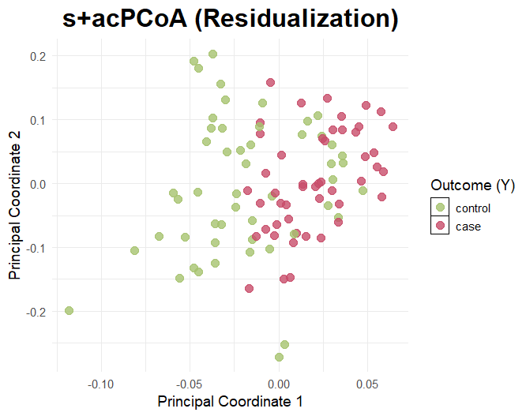

# supPCoA

# supPCoA: Supervised and covariate adjusted principal coordinate analysis

Given that the gut microbiome has been shown to play a critical role in human health and dis-
ease, discerning the relationship between microbial features and disease outcomes is often of interest
in microbiome studies. Most often, this is in terms of visualization of trends in the data and/or
predictive modeling. Dimension reduction techniques such as principal coordinate analysis (PCoA),
an alternative to PCA that relies on non-Euclidean pairwise distances between samples, provides a
lower-dimensional representation for visualization but does not incorporate outcome-related informa-
tion. Therefore, the lower-dimensional principal coordinates may have poor performance visualizing
outcome differences, as well as poor performance in downstream disease prediction tasks. More-
over, covariates, such as demographics, lifestyle factors, and technical variation, can obscure true
biological signals, leading to spurious associations. To address this, we propose a supervised and
covariate-adjusted PCoA algorithm. By minimizing the influence of nuisance variables, our method
produces lower-dimensional representations that better separate disease outcomes in visualizations
and result in improved accuracy in regression and classification models. We demonstrate the effec-
tiveness of the proposed method and highlight its ability to extract meaningful microbiome-disease
associations while mitigating nuisance effects through simulations and application to real 16S rRNA
and metagenomic sequencing studies.

## Usage

1. Visualization
   `supPCoA` can be used to visualize principal coordinate.
2. Prediction
   `supPCoA` can be used to make prediction on outcome (continuous or binary) given microbiome and covariates.


## Main Function
```
lambda_ls = seq(0, 10, 0.5)
results = supPCoA(obj, lambda_ls, nPC = 3, pcoa=TRUE)

# PC plot
results$pc_plot
```

## Results


## Authors

**Crystal Zang**, Lu Tang, Rebecca Deek,

Department of Biostatistics and Data Science, University of Pittsburgh School of Public Health
