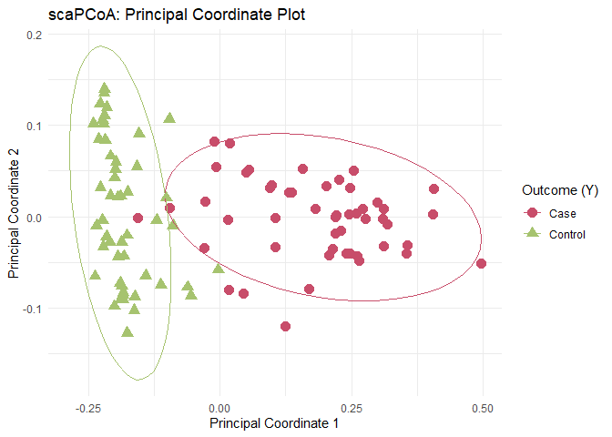

# scaPCoA: Supervised and Covariate-Adjusted Principal Coordinate Analysis

Given that the gut microbiome has been shown to play a critical role in
human health and disease, discerning the relationship between microbial
features and disease outcomes is often of interest in microbiome
studies. Most often, this is in terms of visualization of trends in the
data and/or predictive modeling. Dimension reduction techniques such as
principal coordinate analysis (PCoA), an alternative to PCA that relies
on non-Euclidean pairwise distances between samples, provides a
lower-dimensional representation for visualization but does not
incorporate outcome-related information. Therefore, the
lower-dimensional principal coordinates may have poor performance
visualizing outcome differences, as well as poor performance in
downstream disease prediction tasks. Moreover, covariates, such as
demographics, lifestyle factors, and technical variation, can obscure
true biological signals, leading to spurious associations. To address
this, we propose a supervised and covariate-adjusted PCoA algorithm. By
minimizing the influence of nuisance variables, our method produces
lower-dimensional representations that better separate disease outcomes
in visualizations and result in improved accuracy in regression and
classification models. We demonstrate the effectiveness of the proposed
method and highlight its ability to extract meaningful
microbiome-disease associations while mitigating nuisance effects
through simulations and application to real 16S rRNA and metagenomic
sequencing studies.

## Installation

You can install the development version of scaPCoA:

``` r
remotes::install_github("crystalzang/scaPCoA")
```

## Usage

1.  **Visualization**: `scapcoa` can be used to visualize principal
    coordinates.
2.  **Prediction**: `scapcoa` can be used to make predictions on outcome
    (continuous or binary) given microbiome and covariates.

## Example

``` r
library(scaPCoA)
library(ggplot2)
library(dplyr)

obj <- generate_data(seed = 1, n = 100, p = 200, l = 3, y_type = "bin",
                     zinLDA_min = 100, zinLDA_max = 1000)
#> [1] "Generate data with seed = 1"
#> [1] "N.d:100-1000"
#> [1] "Simulate ZINLDA"
#> [1] "Exclude features with all zeros. Exclude features with variance of zero.\n              Number of features =  191"
#> [1] "Randomly select 50 % of the columns in X"
#> [1] "Exclude features with all zeros. Exclude features with variance of zero.\n              Number of features =  191"
#> [1] "W: 15 features with high correlations."

lambda_ls <- seq(0, 10, 0.5)
results <- scapcoa(obj, lambda_ls, nPC = 3, pcoa = TRUE, residualization = TRUE)
#> [1] "s+acPCoA (Residualization)"
#> [1] "Use bray curtis for X decomposition. Obtained X_hat."
#> [1] "Number of features in X_hat: 55"
#> [1] "Run scaPCoA-R"
#> [1] "lambda= 0"
#> [1] "lambda= 0.5"
#> [1] "lambda= 1"
#> [1] "lambda= 1.5"
#> [1] "lambda= 2"
#> [1] "lambda= 2.5"
#> [1] "lambda= 3"
#> [1] "lambda= 3.5"
#> [1] "lambda= 4"
#> [1] "lambda= 4.5"
#> [1] "lambda= 5"
#> [1] "lambda= 5.5"
#> [1] "lambda= 6"
#> [1] "lambda= 6.5"
#> [1] "lambda= 7"
#> [1] "lambda= 7.5"
#> [1] "lambda= 8"
#> [1] "lambda= 8.5"
#> [1] "lambda= 9"
#> [1] "lambda= 9.5"
#> [1] "lambda= 10"
#> [1] "Best Lambda from tuning: 10"

# Estimated principal coordinates
pc <- results$PC.scores

# Eigen values
eigen_values <- results$eigen_values
```

## Results

``` r
pc %>%
  as.data.frame() %>%
  mutate(Y = ifelse(obj$Y == 1, "Case", "Control")) %>%
  ggplot(aes(x = V1, y = V2, color = Y, shape = Y)) +
  geom_point(size = 3.5, alpha = 1) +
  stat_ellipse(aes(group = Y), linetype = 1) +
  labs(
    x = "Principal Coordinate 1",
    y = "Principal Coordinate 2",
    shape = "Outcome (Y)",
    color = "Outcome (Y)",
    title = "scaPCoA: Principal Coordinate Plot"
  ) +
  theme_minimal() +
  scale_color_manual(values = c("Case" = "#C84D6A", "Control" = "#A6C36F"))
```



## Authors

**Crystal Zang**, Lu Tang, Rebecca Deek

Department of Biostatistics and Data Science, University of Pittsburgh
School of Public Health
